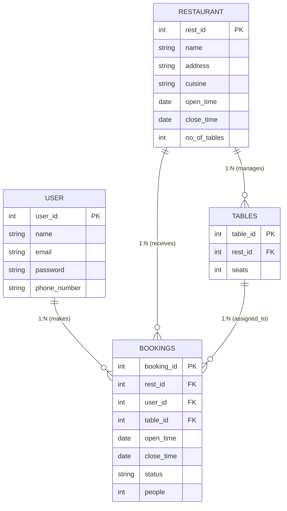

# 🍽️ Khana Khazana 

A comprehensive platform created to improve restaurant efficiency by simplifying operations, organizing services, and enhancing customer satisfaction. This system serves as the central orchestration engine for real-time table reservations and restaurant management.

---


## 📊 Entity-Relationship Diagram
The following diagram illustrates the relational database schema and the **1:N** (One-to-Many) connections between entities, ensuring data normalization and integrity.



## 🛠️ Tech Stack & Integration

### Backend
- Java 17
- Spring Boot

### Data Persistence
- MySQL
- Spring Data JPA for seamless repository abstraction and efficient data management

---

## ✨ Key Functionalities

### Dynamic Table Management
Real-time tracking of table capacity and availability across restaurants.

### Reservation Lifecycle
Complete booking flow management:

`Pending ➝ Confirmed ➝ Cancelled`

### Operational Efficiency
Automated mapping of users to appropriate tables based on party size and availability.

### Unified Search
Efficient retrieval of restaurant information based on cuisine preferences and operational hours.

---

## ⚙️ Setup & Installation

### 1️⃣ Clone the Repository

```bash
git clone https://github.com/ShravaniKorde/Khana-Khazana.git
cd Khana-Khazana
```

### 2️⃣ Database Configuration

Configure your MySQL instance in:

```text
src/main/resources/application.properties
```

Add the following configuration:

```properties
spring.datasource.url=jdbc:mysql://localhost:3306/khana_khazana
spring.datasource.username=your_username
spring.datasource.password=your_password
spring.jpa.hibernate.ddl-auto=update
```

### 3️⃣ Run the Application

```bash
mvn clean install
mvn spring-boot:run
```
